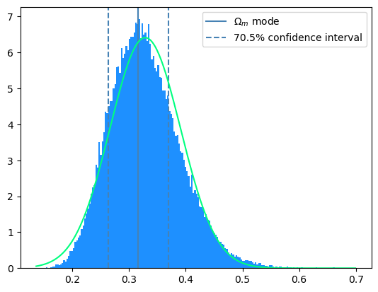

# 🪐Hubble-Parameter-Constrain 


A method to contrain the Hubble parameter using measured data and Markov chains.

## ❔Context

The Hubble parameter $H_0$ is a parameter that, somehow, tunes the expansion of the universe. The expansion rate of the universe is given by a function $H(z)$ that depends on the observed redshift $z$.

$z$ can be thought as the "distance" where the object we observe (with our telescope) is from us. $z$ is called the **redshift** because it quantifies the _"redness"_ of the light we are observing, which has been changed by the [Doppler Effect](https://en.wikipedia.org/wiki/Doppler_effect). Due to [Hubble's Law](https://en.wikipedia.org/wiki/Hubble%27s_law), redshift $z$ and distance are perfectly correlated.

The main idea is that $H(z)$ can be modelled by what we call a Cosmology (the given matter densities of the universe $\Omega_i$) through the [Friedmann equation](https://en.wikipedia.org/wiki/Friedmann_equations):

```math
\frac{H^2}{H_0^2}=\Omega_Ra^{-4}+\Omega_m a^{-3}+\Omega_k a^{-2}+\Omega_\Lambda
```

Making some simplifications and given that $a^{-1}=1-z$, we can set our model equation to be:

```math
\boxed{H(z)=H_0\sqrt{\Omega_m(1+z)^3+(1-\Omega_m)}}
```

With this model, one can compare the measurements of $H(z)$ and $z$ to infer which combination of $\Omega_m$ and $H_0$ fits best.

## 📑Data Set

The data we are given is [``Hz_BC03_all.dat``](./DataSet/Hz_BC03_all.dat), which gives us the measurements of $H(z)$ at each redshift $z$, with some error bars on $H(z)$. So, we first import the necessary libraries:

```python
import numpy as np
import matplotlib.pyplot as plt
import scipy as sp
from scipy.optimize import curve_fit
from scipy.stats import norm
from statistics import NormalDist
import plotly.express as px
from scipy.stats import gaussian_kde
```
and load the dataset into a variable:
```python
# read the data
z, h, herr = np.loadtxt('DataSet/Hz_BC03_all.dat', unpack=True)
```
The dataset contains columns of $z$ (``z``), $H(z)$ (``h``) and $\Delta H(z)$ (error bars ``herr``).

### *️⃣First test

To see some examples, we can try to plot the dataset with some random-generated curves of our model.

```python
# plot the data
plt.errorbar(z, h, yerr = herr, color = 'grey', fmt = 'o', label = 'Measured data')
x = np.linspace(0, 2, 100)
curves = []
Omegas = np.linspace(0.25, 0.75, 3)
H00 = np.linspace(25, 100, 3)

# sample some curves
def H(aH, H0, Omega):
    k = np.array([])
    for i in range(0, len(aH)):
        k = np.append(k, H0 * np.sqrt(Omega * (1 + aH[i]) ** 3 + (1 - Omega)))
    return k

for l in H00:
    for j in Omegas:
        curves.append(H(x, l, j))
        plt.plot(x, H(x, l, j), label = r'$\Omega_m=${} , $H_0=${}'.format(j,l))

        
plt.xlabel(r'$z$')
plt.ylabel(r'$H(z)$')
plt.legend(loc = 'best', fontsize = 7)
plt.show()
```


As it can be seen, some curves like $\Omega_m=0.5$ and $H_0=62.5$ fit pretty well; but we do not have yet a way to quantify how well do they fit and how correlated they may be if we change one of them.

As it is obvious, it is convenient to define a function to calculate $H(z)$ for each combination of its variables:

```python
# define a function to calculate H in each point
def Hp(zz, H0, Omega):
    return H0 * np.sqrt(Omega * (1 + zz) ** 3 + (1 - Omega))
```

To do a further study, we need Bayesian statistics and Markov chain Montecarlo (MCMC) with Metropolis implementation.

## ⛓️Markov chain Montecarlo (MCMC)

### 👌Likelihood

Before digging into Markov chains, it is necessary to introduce the Likelihood function. It is defined as the probability of a variable taking a certain value $x$ **given that the hypothesis $\theta$ is true** ($\mathcal L(x|\theta)$). For our case, we will assume that each value of the dataset follows a gaussian distribution. So, given that the hypothetic values of $\Omega_m$ and $H_0$ are the real ones, the probability of measuring a single data point should be:

```math
\mathcal L(H_i,z_i,\Delta H_i|\Omega_m,H_0) = \exp\left(-\frac{(H_i-H(z_i,\Omega_m,H_0))^2}{4\Delta H_i^2}\right)
```

And, the Likelihood of the whole sample is just the multiplication of the Likelihoods:

```math
\mathcal L(\text{Dataset}|\Omega_m,H_0) = \prod_i\exp\left(-\frac{(H_i-H(z_i,\Omega_m,H_0))^2}{4\Delta H_i^2}\right)=\exp\left(-\sum_i\frac{(H_i-H(z_i,\Omega_m,H_0))^2}{4\Delta H_i^2}\right)
```
```python
# define the posterior likelihood as a multiple variable function (one variable per data)
def Lik(zz, hh, herrr, HH0, OOmega):
    aa = 0
    for i in range(0, len(zz)):
        aa -= (hh[i] - Hp(zz[i], HH0, OOmega)) ** 2 / (herrr[i] ** 2)
    return np.exp(aa / 2.0)
```

Also, we need to define the prior probability of the assumption of the hypothesis ($\Omega_m, H_0$). This step is really important and, as you will see, it completely changes the final result.

For the moment, we will assume it exists and has a defined expression, we will come back to it later.

### :chains: The MCMC + Metropolis algorithm

This algorithm allows us to find a good approximation of the probability distribution function of the two desired parameters ($\Omega_m$, $H_0$) given a dataset and a prior probability.

The idea is to navigate through the ($\Omega_m\times H_0$) space marking our steps. Whenever we go through the same spot, put another mark and so on. The result will be a 2D histogram of the places where we have been. The expected result is something with a central value, the one that is most probable, and some uncertainty arround it.

So, to get a plot with these properties, we would have to "walk" according to the probabilities, so that we go through the most probable spot more times than the others with less probability. We may define a function ``mcmc()`` that takes ``it`` (number of iterations), ``step`` (length of the $H_0$ step) and ``ostep`` (lentgh of the $\Omega_m$ step), returns an array of points where we have been and their Likelihoods (``[Hs, Omegas,Likelihoods]``), and counts the **acceptance rate** of the process (we will talk about this later).

The alorithm goes like this:

* 0: define the function and initialize the output arrays.

```python
def mcmc(it, step, ostep):
    # (iterations, distance step of H, distance step of Omega)
    # we define a list to store the 3 variables inputted into the function and the new computed
    Likelihoods = np.zeros(it)
    Hs = np.zeros(it)
    Omegas = np.zeros(it)
```

* 1: choose some initial values (where we begin to walk) according to their prior probabilities (this may change in the future).

```python
    # We randomly choose initial values to start the computation, following the prior function
    H_old = float(np.random.uniform(50, 100, 1))
    Omega_old = float(np.random.uniform(0, 1, 1)) #this prior may change later
    Lik_old = float(Lik(z, h, herr, H_old, Omega_old))

    # store the values
    Hs[0] = H_old
    Omegas[0] = Omega_old
    Likelihoods[0] = Lik_old
    
    # we'll count the accepted steps to compute the efficiency later
    accepted = 0
```

* 2: Choose randomly a direction where we **want to take a step** (because we may not take it at the end), based on the length of the steps. Take the step ($H_{new} = H_{old} + dH$, etc.) and compute the Likelihood in this new spot, defined as $\mathcal L_{new} = \mathcal L_{old} \cdot \text{prior}$. As we said, the prior may be chosen later.

```python
    for i in range(1, it):
        
        # we choose a step for each variable, following a normal distribution
        dH = np.random.normal(0, step, 1)
        dOmega = np.random.normal(0, ostep, 1)
        
        # we compute the new values of the variables and their posterior (likelihood*prior)
        H_new = H_old + dH
        Omega_new = Omega_old + dOmega
        Lik_new = float(Lik(z, h, herr, H_new, Omega_new) * prior(H_new, Omega_new))
```

* 3: Now, the Metropolis algorithm. This enables us to have a criterium on the probability to take the step. (notice that if all the steps were always taken, the alorithm would be useless for our goal).
    * 3.1: If the posterior probability (defined as the new Likelihood) is superior to the previous, take the step and store it. The reason why is that the step is being taken towards a more probable region.

```python
        # now, the metropolis algorithm to accept or reject
        # if the new posterior is greater than in the previous step, we accept the change
        if i > 0 and Lik_new >= Lik_old:
            Hs[i] = H_new
            Omegas[i] = Omega_new
            Likelihoods[i] = Lik_new
            accepted += 1
            #make the old variables the new ones to use them in the loop
            H_old = H_new
            Omega_old = Omega_new
            Lik_old = Lik_new
```
*
    * 3.2: Otherwise, we throw a die to see if we accept the change or not.

```python
        # if the new posterior is smaller, the we throw a die
        elif i > 0 and Lik_new < Lik_old:
            # we choose a random value between 0 and 1
            f = np.random.random(1)
            # if it lands further than the ratio post_new/post_old, we reject the change 
            if f >= Lik_new / Lik_old:
                Hs[i] = Hs[i - 1]
                Omegas[i] = Omegas[i - 1]
                Likelihoods[i] = Likelihoods[i - 1]

            # if it lands otherwise, we accept it
            if f < Lik_new / Lik_old:
                Hs[i] = H_new
                Omegas[i] = Omega_new
                Likelihoods[i] = Lik_new
                accepted += 1
                H_old = H_new
                Omega_old = Omega_new
                Lik_old = Lik_new
        else:
            Hs[i] = Hs[i - 1]
            Omegas[i] = Omegas[i - 1]
            Likelihoods[i] = Likelihoods[i - 1]
```

* 4: Repeat it until we reach ``it`` iterations.
* 5: Return the collected values.

```python
    return [Hs, Omegas, Likelihoods, accepted / (it - 1)]
```

Now that we have our method to calculate and register our walking path (the chain), we have to do what is called the burn-in.

### 🔥Burn-in

The burn in is simply a process where we reject (_burn_) the initial data of the Markov chain. This is due to the fact that the steps are not stabilized arround the most probable value. This, consequently leads to having some noise at the beggining of the path. For our case, we will reject a $10$% of the total chain.

## ❓Uninformative prior

For a first "try", we will assume a uniform probability (that is, it is equally probable to assume each value within a range). This is known as an **"uninformative prior"**. The ``prior function`` will be defined in the following way:

```python
# now, the prior
def prior(hh,OOmega):
    if 50 < hh < 100 and 0 < OOmega < 1:
        return 1.0
    else:
        return 0.0
```

We have chosen these values because $\Omega_m$ is a density rate (always goes from 0 to 1) and $H_0$ is for sure between $50$ and $100$, as all the experiments point out.

Now, if we run $5$ different chains (``chains = 5``) with our ``mcmc()`` function, we can plot the path we take in each variable direction:

```python
# we run the mcmc 
iterations = 10 ** 5
pos = np.linspace(0, iterations, iterations)
chains = 5
pOmega = []
pH = []
Likeli = []
Efficiency = []

# plot the Hs
for kk in range(0, chains):
    simulation = mcmc(iterations, 1, 0.025)
    pH.append(simulation[0])
    pOmega.append(simulation[1])
    Likeli.append(simulation[2])
    Efficiency.append(simulation[3])

    plt.plot(pos, pH[kk], label = 'Chain {}'.format(kk + 1), alpha = 0.5)
    plt.ylabel(r'$H$')
    plt.xlabel(r'Steps')
    plt.xscale('log')
    plt.title('$H$ chain')

plt.axvspan(0, 10 ** 4, color = 'red', alpha = 0.1, label = 'burn-in')
plt.legend(loc = 'best')
plt.show()

# plot the Omegaas
for kk in range(0, chains):
    plt.plot(pos, pOmega[kk], label = 'Chain {}'.format(kk + 1), alpha = 0.5)
    plt.ylabel(r'$\Omega_m$')
    plt.xlabel(r'Steps')
    plt.xscale('log')
    plt.title('$\Omega_m$ chain')

plt.axvspan(0, 10 ** 4, color = 'red', alpha = 0.1, label = 'Burn-in')
plt.legend(loc = 'best')
plt.show()
```

  

### 🧮Efficiency and convergence

The efficiency is simply defined as the rate of acceptance of the Metropolis algorithm.

```python
# print efficiency
print('Efficiency = {}'.format(np.mean(Efficiency)))
```
* Efficiency = $0.702$

The convergence $R$ is much more complicated to calculate. We are going to use the [Gelman Rubin](https://en.wikipedia.org/wiki/Gelman-Rubin_statistic) metric for the convergence.

```python
# print(pH)
# define a function that calculates the convergence metric for a given chain
def R(CHAIN, nchains):
    N = len(CHAIN[0])
    B = 0
    W = 0
    yCHAIN = []
    for kk in range(0, nchains):
        yCHAIN.append(np.mean(CHAIN[kk]))
    ybarCHAIN=float(np.mean(yCHAIN))
    summ = 0
    for i in range(0, nchains):
        summ += (yCHAIN[i] - ybarCHAIN) ** 2
    B = 1 / (nchains-1) * summ
    summ2 = 0
    for i in range(0, N):
        for j in range(0, nchains):
            summ2 += (CHAIN[j][i] - yCHAIN[j]) ** 2
    W = 1 / (nchains*(N - 1)) * summ2
    return ( (N - 1) / N * W + B * (1 + 1 / nchains)) / W

print('R of H =  {}\nR of Omega = {}'.format(R(pH, chains), R(pOmega, chains)))
```

* $R(H) =  1.00043$
* $R(\Omega) = 1.0004$

To ensure convergence it has to be in the range $R\in(1,1.03)$, task accomplished ✔️.

### ⛰️Density distribution

The density distribution can be plotted just by making a scatter of all data, colouring it by density:
```python
# arange all the chains in one
X = np.array([])
Y = np.array([])
for nn in range(0, chains):
    # we plot the 20% of the total points to optimize the execution
    X = np.concatenate((X, pH[nn][int(7 * 10 ** 4):]), axis = 0)
    Y = np.concatenate((Y, pOmega[nn][int(7 * 10 ** 4):]), axis = 0)
xy = np.vstack([X, Y])

# sort by color/density
Z = gaussian_kde(xy)(xy)
idx = Z.argsort()
X, Y, Z = X[idx], Y[idx], Z[idx]
fig, ax = plt.subplots()
Real = ax.scatter(X, Y, c = Z, s = 10)
plt.title('Posterior distribution')
plt.xlabel(r'$\Omega_m$')
plt.ylabel(r'$H$')
plt.show()
```


As it can be seen, the two parameters are statistically correlated negativily. This means that whenever we raise a variable's value, the other one has to lower in order to fit the data.

### 🗻Shape of the distribution

Another thing we can analyze is the shape of the distributions, their confidence level and the similarity with a gaussian distribution:

```python
# define the function that calulates the 68% confidence interval
def conf(hist):
    #calculate the total area
    area = np.sum(hist[0])
    modeindex = int(np.argmax(hist[0]))
    mode = hist[1][modeindex]
    summ = float(hist[0][modeindex])
    i = 1
    for k in range(0,len(hist[0])):
        summ += float(hist[0][modeindex + 1])
        if summ / area < 0.68:
            summ += float(hist[0][modeindex - 1])
            i += 1
        else:
            break
    return [hist[1][modeindex - i], hist[1][modeindex + i],summ / area]


def gauss(chain,hist):
    xx = np.linspace(np.min(chain), np.max(chain), 300)
    std = np.std(chain)
    mean = np.mean(chain)
    gau = []
    for k in range(0, len(xx)):
        gau.append(1 / np.sqrt(2 * std ** 2 * np.pi) * np.exp(-(xx[k]-mean) ** 2 / (2 * std ** 2)))
    return [xx, gau]
    
        
bins = 200
# plot the histograms separately
histH = np.histogram(X, bins = bins)
mH=histH[1][np.argmax(histH[0])]
print('{:.4}% confidence interval of H = {}'.format(100 * conf(histH)[2], conf(histH)[0:2]))


histO = np.histogram(Y, bins = bins)
mO = histO[1][np.argmax(histO[0])]
print('{:.4}% confidence interval of Omega = {}'.format(100 * conf(histO)[2], conf(histO)[0:2]))
print('H mode = {}\nOmega mode = {}'.format(mH, mO))
lowX = []
highX = []
lowY = []
highY = []
for k in range(0, len(X)):
    if X[k] < conf(histH)[0] or X[k] > conf(histH)[1]:
        lowX.append(X[k])
    else:
        highX.append(X[k])
for k in range(0, len(Y)):
    if Y[k] < conf(histO)[0] or Y[k] > conf(histO)[1]:
        lowY.append(Y[k])
    else:
        highY.append(Y[k])


histH = plt.hist(X ,bins=int(bins), color = 'dodgerblue', density = True)
plt.axvline(mH, label = '$H$ mode', color = 'steelblue')
plt.axvline(conf(histH)[1], label = '{:.3}% confidence interval'.format(100 * conf(histH)[2]), color = 'steelblue', linestyle = '--')
plt.axvline(conf(histH)[0], color = 'steelblue', linestyle = '--')
plt.plot(gauss(X, histH)[0], gauss(X,histH)[1], color = 'springgreen')
plt.legend(loc = 'best')
plt.show()

histO = plt.hist(Y, bins = int(bins), color = 'dodgerblue', density = True)
plt.axvline(mO, label = '$\Omega_m$ mode', color = 'steelblue')
plt.axvline(conf(histO)[1], label = '{:.3}% confidence interval'.format(100 * conf(histO)[2]), color = 'steelblue', linestyle = '--')
plt.axvline(conf(histO)[0], color = 'steelblue', linestyle = '--')
plt.plot(gauss(Y ,histO)[0], gauss(Y,histO)[1], color = 'springgreen')
plt.legend(loc = 'best')
plt.show()
```
  

As it can be seen, the $H$ distribution is much more gaussian that the $\Omega_m$ one.

We can now generate random curves following those distributions, to visualize how would the **true** curve look when fitting the data.

```python
# plot the data
plt.errorbar(z, h, yerr = herr, color = 'grey', fmt = 'o', label = 'Measured data')
x = np.linspace(0, 2, 100)
curves = []
Omegas = []
H00 = []
al = []
n = 20
for k in range(0, n):
    al.append(np.random.randint(0, len(X)))
for k in range(0, len(al)):
    Omegas.append(Y[al[k]])
    H00.append(X[al[k]])


# sample some curves
def H(aH,H0,Omega):
    k = np.array([])
    for i in range(0, len(aH)):
        k = np.append(k, H0 * np.sqrt(Omega * (1 + aH[i]) ** 3 + (1 - Omega)))
    return k


for j in range(0, n):
    curves.append(H(x, H00[j], Omegas[j]))
    plt.plot(x, H(x, H00[j], Omegas[j]), color = 'dodgerblue', linestyle = ':', alpha = 0.3)
plt.plot([0], [0], color = 'dodgerblue', linestyle = ':', label = 'Generated curves')
        
plt.xlabel(r'$z$')
plt.ylabel(r'$H(z)$')
plt.legend(loc = 'best', fontsize = 7)
plt.show()
```


## 🍄Gaussian prior

Now, we have more information about $\Omega_m$. The [Planck's satelite](https://en.wikipedia.org/wiki/Planck_(spacecraft)) has measured $\Omega_m = 0.315 \pm 0.007$, which can make us change our prior probability to a gaussian distribution with those parameters.

```python
# new prior
def prior2(hh, OOmega):
    m = 0.315
    std = 0.007
    if 50 < hh < 100:
        return 1 / np.sqrt(2 * std ** 2 * np.pi) * np.exp(-(OOmega - m) ** 2 / (2 * std ** 2))
    else:
        return 0.0
```

This means that inside our ``mcmc()`` function we will have to change the line where we define the first step, ``Omega_old``:

```python
Omega_old = float(np.random.normal(0.315, 0.007))
```

Running the $5$ chains again, we obtain different results:


  

As it can be seen, in this case the walking is much more localized arround the mean, denoting that we have a much more restrictive prior.

### 🧮Efficiency and convergence

The fact that the prior is more restrictive implies that the efficiency has decreased considerably.

* Efficiency = $0.292$

The convergence $R$, still, is optimal:

* $R(H) =  1.000490$
* $R(\Omega) = 1.0000821$

### ⛰️Density distribution


As we said, the density distribution has a much more localized shape. Now, the variables are less correlated because we are restricting more the freedom of $\Omega_m$. It may seem that the distribution is wider than in the other case, but the limits of the plot indicate that it covers a smaller area.

### 🗻Shape of the distribution

  

As it can be seen, now, both distributions fit perfectly a gaussian one ✔️.


The possible curves go through a smaller interval than the previous case, we have reduced uncertainty ✔️.

## ⚖️Comparison

Both cases lead to values of $H_0$, which was the main objective. Also, with the gaussian distribution we have obtained thinner confidence intervals. The values and uncertainties have changed significatively when introducing the gaussian prior in $\Omega_m$

* Uninformative prior
   * $H = 68.89$, CI = $[65.93, 71.85]$
   * $\Omega_m = 0.316$, CI = $[0.263, 0.370]$
* Gaussian prior
   * $H = 68.54$, CI = $[66.85, 70.22]$
   * $\Omega_m = 0.314$, CI = $[0.308, 0.321]$
 
The conclusion is that gathering information about any parameter in a model, even if it has a wide confidence level, may be game-changing. The resulting fit may be much more localized and could give restrictions on key parameters.

All this analysis can, of course, be applied to any model you could think of. Now, your only limit is your imagination 🤓! (😆)
